```{css,echo = F}
.small .remark-code { /*Change made here*/
  font-size: 85% !important;
}
.tiny .remark-code { /*Change made here*/
  font-size: 50% !important;
}
```

```{r,include=F}
set.seed(123)
options(width=60)
knitr::opts_chunk$set(fig.align='center',fig.width=9,fig.height=5)
def.chunk.hook  <- knitr::knit_hooks$get("chunk")
knitr::knit_hooks$set(chunk = function(x, options) {
  x <- def.chunk.hook(x, options)
  ifelse(options$size != "normalsize", paste0("\n \\", options$size,"\n\n", x, "\n\n \\normalsize"), x)
})
```

# Agenda

1. Meet the instructor

2. Course Motivation

3. Course Objectives

4. ChatGPT and data science
  
5. Course Expectations & Syllabus review

BREAK

6. Intro to `R`

---

# Meet the instructor

- Education

--

  - PhD from NYU Politics in 2019

  - Postdocs at Princeton Niehaus & NYU CSMaP
  
--

- Published some things

--

  - Methods-ey: external validity [1](https://www.journals.uchicago.edu/doi/full/10.1086/691280?af=R), [2](https://www.cambridge.org/core/journals/american-political-science-review/article/testing-social-science-network-theories-with-online-network-data-an-evaluation-of-external-validity/4BF517F10F38DFB574FED4A3D805B613); measurement [3](https://www.cambridge.org/core/journals/american-political-science-review/article/barp-improving-mister-p-using-bayesian-additive-regression-trees/630866EB47F9366EDB3C22CFD951BB6F), [4](https://www.cambridge.org/core/journals/political-analysis/article/geographic-boundaries-and-local-economic-conditions-matter-for-views-of-the-economy/32C8C058B8E16CAD48374F95B2B1B3EF)

  - Substantive: economics & populism [1](https://www.tandfonline.com/doi/full/10.1080/13501763.2019.1678662); Covid-19 & U.S. politics [2](https://www.journals.uchicago.edu/doi/10.1086/716969),  [3](https://www.cambridge.org/core/journals/american-political-science-review/article/flight-to-safety-covidinduced-changes-in-the-intensity-of-status-quo-preference-and-voting-behavior/AE84D93BAF8B27284DD8F6A75DE5D18A); IPE [4](https://doi.org/10.1017/S0020818319000109); academic naval-gazing [5](https://www.cambridge.org/core/journals/perspectives-on-politics/article/abs/polisci-twitter-a-descriptive-analysis-of-how-political-scientists-use-twitter-in-2019/C8A193C3E939C1ABCD4600DFE8AEF79A?utm_source=hootsuite&utm_medium=twitter&utm_campaign=PPS_Dec20)

  - Popular press: [1](https://www.washingtonpost.com/news/monkey-cage/wp/2018/04/04/losing-jobs-to-free-trade-makes-americans-more-protectionist-and-nativist/), [2](https://www.washingtonpost.com/politics/2020/04/02/sanders-was-losing-biden-anyway-he-lost-more-areas-with-coronavirus-cases/?utm_medium=social&utm_source=twitter&utm_campaign=wp_monkeycage), [Podcasts](https://www.niskanencenter.org/did-chinese-trade-competition-increase-nativism-and-elect-trump/)
  
--

- Work

--

  - World Bank / IFC
  
  - MarketCast

---

# Meet the instructor

- Current research

--

  - .red[YouTube] + .blue[polarization]

--

  - .red[Twitter] + .blue[misinformation]
  
--

  - .red[Telegram] + .blue[white supremacists]
  
--

  - .red[Stocks] + .blue[politicians]

---

# Why are you here?

--

background-image: url(./figs/fight_ds_econ.PNG)
background-size: contain

--

background-image: url(./figs/fight_ds_ps.PNG)
background-size: contain

--

background-image: url(./figs/fight_ds_cs.PNG)
background-size: contain

--

background-image: url(./figs/fight_ds_stats.PNG)
background-size: contain

--

background-image: url(./figs/fight_ds_stem.PNG)
background-size: contain

---

# Is this all just a fad?

--

- No


<center>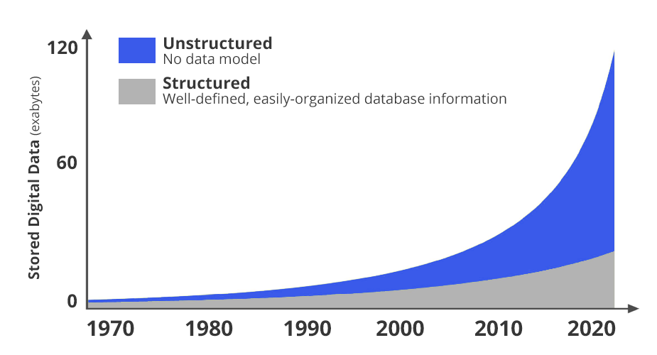</center>


---

# Is this all just a fad?

- But there are faddish qualities

<center></center>


---

# So what IS data science?

- Split into two camps

--

1. .blue[Research] camp

--

  - Focused on **answering a research question**
  
  - Follows the "scientific method"
  
  - Goal: contribute to knowledge
  
  - Domain: academia
  
--
  
2. .red[Prediction] camp

--

  - Focused on **making a prediction**
  
  - Typically unconcerned with theory or *why* a model works
  
  - Goal: inform a decision / policy
  
  - Domain: private sector

--
  
(3. .red[Learning] camp)

--

  - Let the data "speak"
  
  - (More of a subset of camps 1 and 2)
  
---

# The Two Camps

<center></center>

---

# The Two Camps

<center>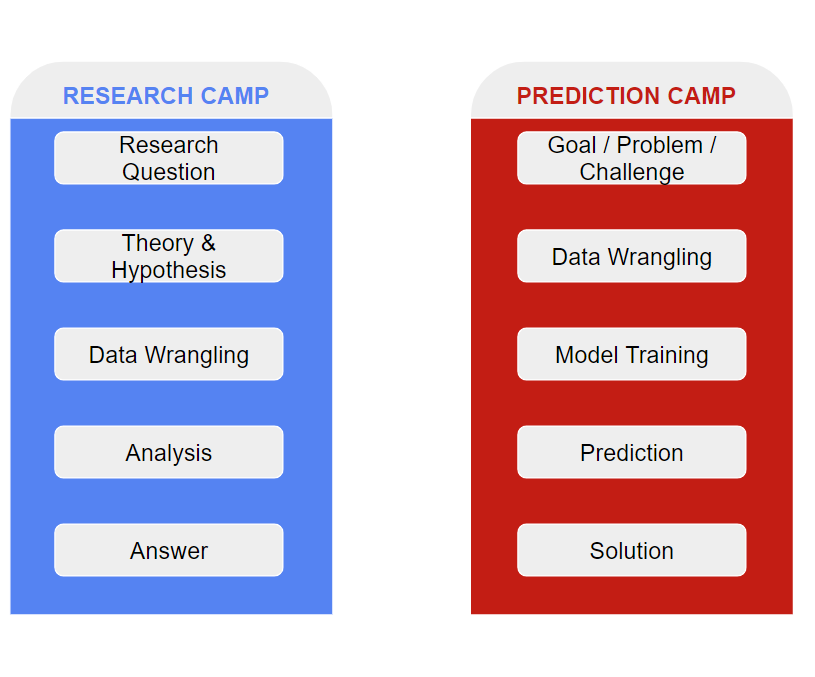</center>

---

# The Two Camps

<center>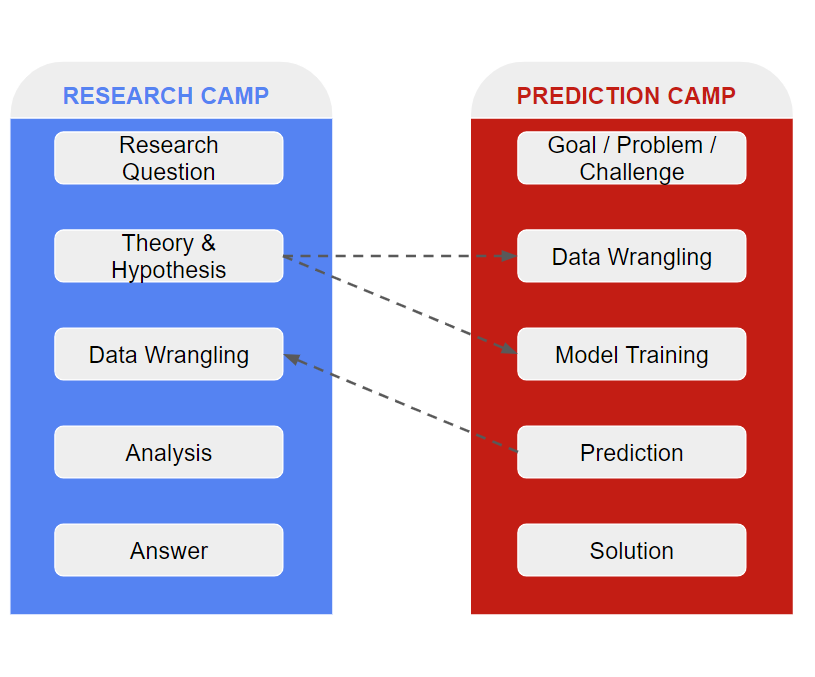</center>

---

# .blue[Research] Camp

- The scientific method

  1. .red[Observation] &rarr; .blue[Question]

--

  2. .blue[Theory] &rarr; .blue[Hypothesis]

--

  3. .red[Data Collection / Wrangling] &rarr; .red[Analysis]

--

  4. .red[Results] &rarr; .blue[Conclusion]
  
--

```{r,echo=F,fig.height=3,fig.align='center',warning=F,message=F}
require(tidyverse)
data.frame(step = c('Observation','Question','Theory','Hypothesis','Data Collection',
                    'Analysis','Results','Conclusion'),
           Framework = c('Data','Science','Science','Science','Data','Data','Data','Science'),
           x = c(.5,1.5,2.5,3.5,4.5,5.5,6.5,7.5),
           xend = c(1.5,2.5,3.5,4.5,5.5,6.5,7.5,8.5),
           y = c(-.5,-1,-2,-.75,-2,-1,-.75,-.5),
           yend = c(.5,1,2,.75,2,1,.75,.5)) %>%
  ggplot(aes(x = x,y = y,fill = Framework)) + 
  geom_rect(aes(xmin = x,ymin = y,xmax = xend,ymax = yend)) + 
  # geom_rect(xmin = c(2.5),ymin = c(-2),xmax = c(3.5),ymax = c(2),fill = NA,color = 'black',lwd = 2,
  #           inherit.aes = F) + 
  # geom_rect(xmin = c(4.5),ymin = c(-2),xmax = c(5.5),ymax = c(2),fill = NA,color = 'black',lwd = 2,
  #           inherit.aes = F) + 
  scale_fill_manual(values = c('red','blue')) +
  theme(axis.text.y = element_blank(),
        panel.background = element_rect(fill = 'grey90'),
        panel.grid.major = element_blank(), panel.grid.minor = element_blank(),
        axis.ticks = element_blank(),
        plot.background = element_rect(
          fill = "grey90" #,
          # colour = "black",
          # size = 1
        ),
        axis.text.x = element_text(angle = 45,hjust = 1,size = 14)) + 
  scale_x_continuous(breaks = seq(1,8,by = 1),labels = c('Observation','Question','Theory','Hypothesis','Data Prep',
                                                         'Analysis','Results','Conclusion')) + 
  xlab(NULL) + ylab(NULL)
```


---

# .blue[Research] Camp

- The scientific method

  1. .red[Observation] &rarr; .blue[Question]

  2. .blue[Theory] &rarr; .blue[Hypothesis]

  3. .red[Data Collection / Wrangling] &rarr; .red[Analysis]

  4. .red[Results] &rarr; .blue[Conclusion]

```{r,echo=F,fig.height=3,fig.align='center',warning=F,message=F}
require(tidyverse)
data.frame(step = c('Observation','Question','Theory','Hypothesis','Data Collection',
                    'Analysis','Results','Conclusion'),
           Framework = c('Data','Science','Science','Science','Data','Data','Data','Science'),
           x = c(.5,1.5,2.5,3.5,4.5,5.5,6.5,7.5),
           xend = c(1.5,2.5,3.5,4.5,5.5,6.5,7.5,8.5),
           y = c(-.5,-1,-2,-.75,-2,-1,-.75,-.5),
           yend = c(.5,1,2,.75,2,1,.75,.5)) %>%
  ggplot(aes(x = x,y = y,fill = Framework)) + 
  geom_rect(aes(xmin = x,ymin = y,xmax = xend,ymax = yend)) + 
  geom_rect(xmin = c(2.5),ymin = c(-2),xmax = c(3.5),ymax = c(2),fill = NA,color = 'black',lwd = 2,
            inherit.aes = F) + 
  geom_rect(xmin = c(4.5),ymin = c(-2),xmax = c(5.5),ymax = c(2),fill = NA,color = 'black',lwd = 2,
            inherit.aes = F) + 
  scale_fill_manual(values = c('red','blue')) +
  theme(axis.text.y = element_blank(),
        panel.background = element_rect(fill = 'grey90'),
        panel.grid.major = element_blank(), panel.grid.minor = element_blank(),
        axis.ticks = element_blank(),
        plot.background = element_rect(
          fill = "grey90" #,
          # colour = "black",
          # size = 1
        ),
        axis.text.x = element_text(angle = 45,hjust = 1,size = 14)) + 
  scale_x_continuous(breaks = seq(1,8,by = 1),labels = c('Observation','Question','Theory','Hypothesis','Data Prep',
                                                         'Analysis','Results','Conclusion')) + 
  xlab(NULL) + ylab(NULL)
```


---

# .blue[Research] Camp

--

<center></center>

---

# .blue[Research] Camp

1. **.red[Observation]** &rarr; **.blue[Question]**
  
--

  - Observation is facilitated by .red[data] (Descriptive analysis)

--

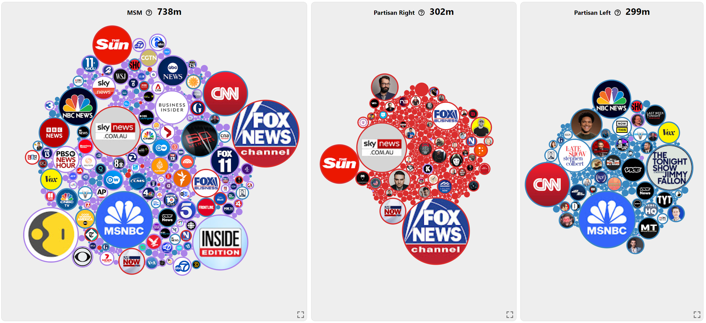

---

# .blue[Research] Camp

1. **.red[Observation]** &rarr; **.blue[Question]**

  - Observation is facilitated by .red[data] (Descriptive analysis)


---

# .blue[Research] Camp

1. **.red[Observation]** &rarr; **.blue[Question]**

  - Observation is facilitated by .red[data] (Descriptive analysis)


---

# .blue[Research] Camp

1. **.red[Observation]** &rarr; **.blue[Question]**

  - The question pertains to .blue[science]
  
--

  - I.e., does YouTube's algorithm put users into "echo chambers"?

--

<center></center>

---

# .blue[Research] Camp

<ol start = 2>

<li> **.blue[Theory]** &rarr; **.blue[Hypothesis]**
  
--

  - Theorizing requires abstraction & simplification

  - I.e., people (in general) avoid conflict

--

<center>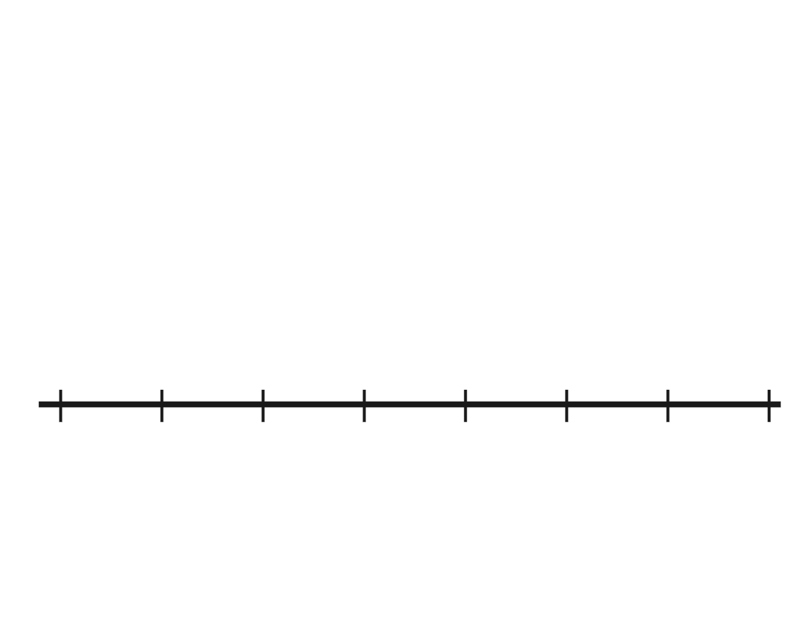</center>

---

# .blue[Research] Camp

<ol start = 2>

<li> **.blue[Theory]** &rarr; **.blue[Hypothesis]**

  - Theorizing requires abstraction & simplification

  - I.e., people (in general) avoid conflict

<center>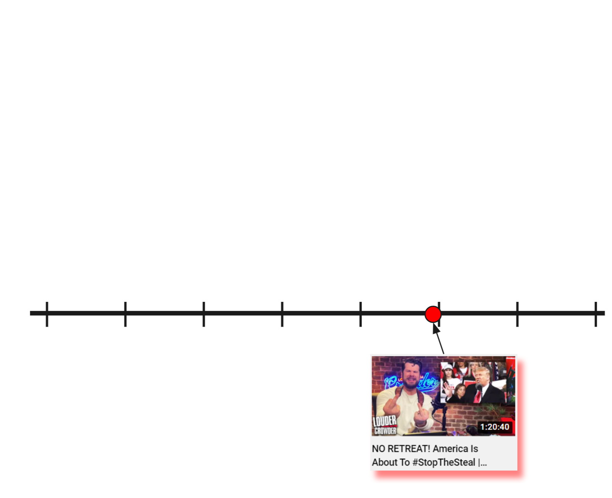</center>

---

# .blue[Research] Camp

<ol start = 2>

<li> **.blue[Theory]** &rarr; **.blue[Hypothesis]**

  - Theorizing requires abstraction & simplification

  - I.e., people (in general) avoid conflict

<center>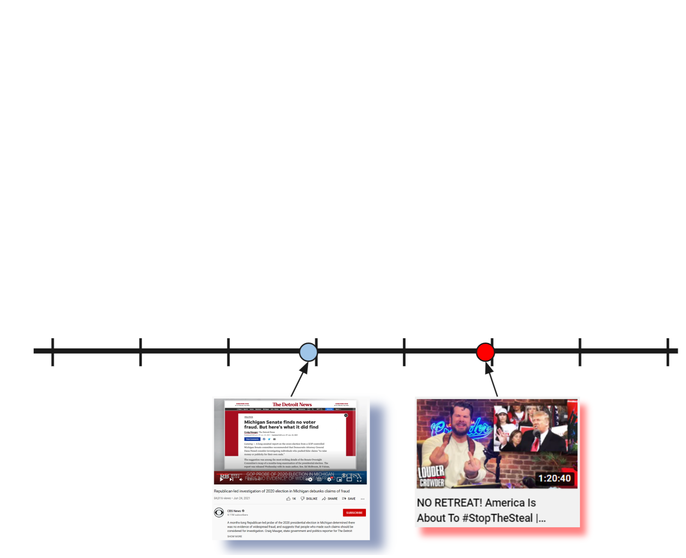</center>

---

# .blue[Research] Camp

<ol start = 2>

<li> **.blue[Theory]** &rarr; **.blue[Hypothesis]**

  - Theorizing requires abstraction & simplification

  - I.e., people (in general) avoid conflict

<center>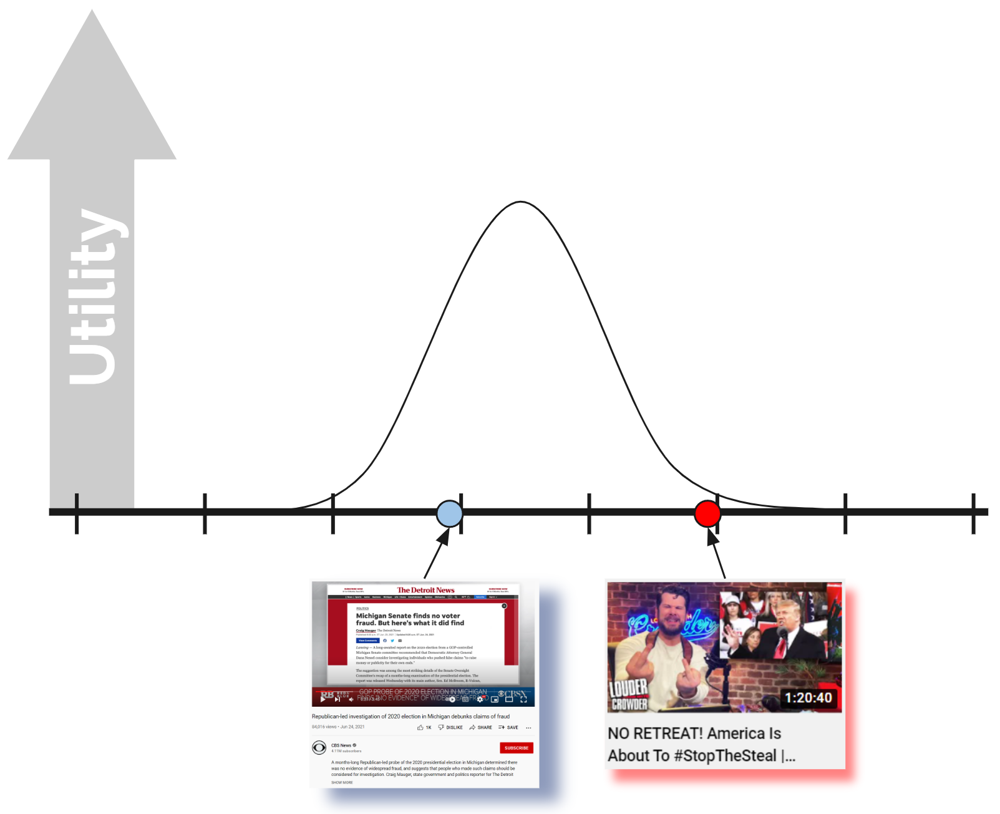</center>


---

# .blue[Research] Camp

<ol start = 2>

<li> **.blue[Theory]** &rarr; **.blue[Hypothesis]**

  - Theorizing requires abstraction & simplification

  - I.e., people (in general) avoid conflict

<center></center>

---

# .blue[Research] Camp

<ol start = 2>

<li> **.blue[Theory]** &rarr; **.blue[Hypothesis]**

  - Theorizing requires abstraction & simplification

  - I.e., people (in general) avoid conflict
  
  - YouTube wants users to watch more videos

--

.leftcol[
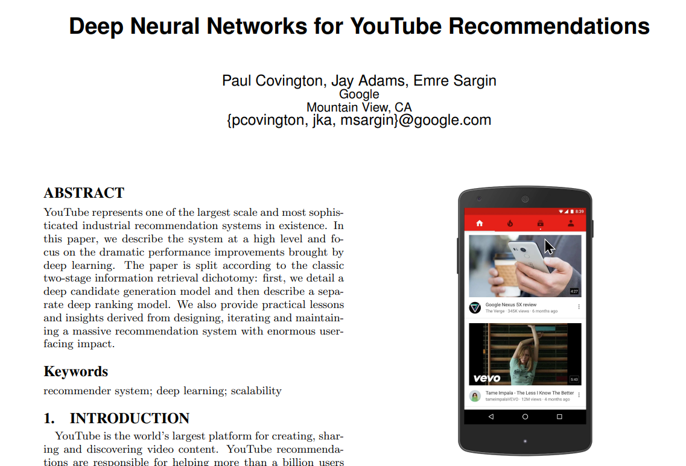
]

--

.rightcol[

]


---

# .blue[Research] Camp

<ol start = 2>

<li> **.blue[Theory]** &rarr; **.blue[Hypothesis]**

  - Theorizing requires abstraction & simplification

  - I.e., people (in general) avoid conflict
  
  - YouTube wants users to watch more videos

- Hypotheses fall out naturally from well-done theory

--

- **H1:** *YouTube's recommendation algorithm should suggested liberal content to liberals and conservative content to conservatives.*


---

# .blue[Research] Camp

<ol start = 3>

<li> **.red[Data Collection / Wrangling]** &rarr; **.red[Analysis]**

  - Data collection separates "Data Science"...
  
  - ...from "Science, with data"
  
<center></center>

---

# .blue[Research] Camp

<ol start = 3>

<li> **.red[Data Collection / Wrangling]** &rarr; **.red[Analysis]**

  - Data collection separates "Data Science"...
  
  - ...from "Science, with data"
  
<center></center>

---

# .blue[Research] Camp

<ol start = 3>

<li> **.red[Data Collection / Wrangling]** &rarr; **.red[Analysis]**

  - Data collection separates "Data Science"...
  
  - ...from "Science, with data"
  
<center>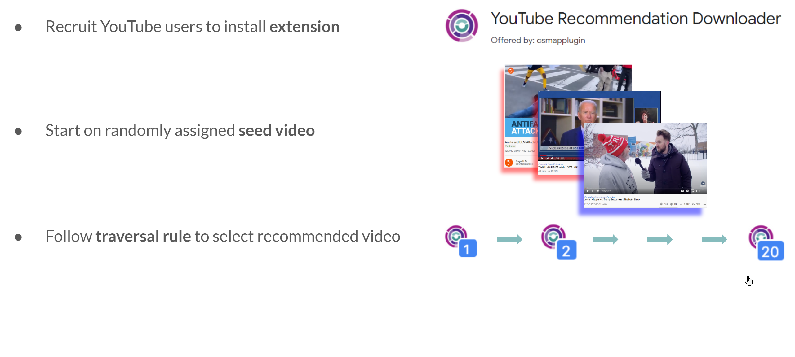</center>

---

# .blue[Research] Camp

<ol start = 3>

<li> **.red[Data Collection / Wrangling]** &rarr; **.red[Analysis]**

  - Data collection separates "Data Science"...
  
  - ...from "Science, with data"
  
<center>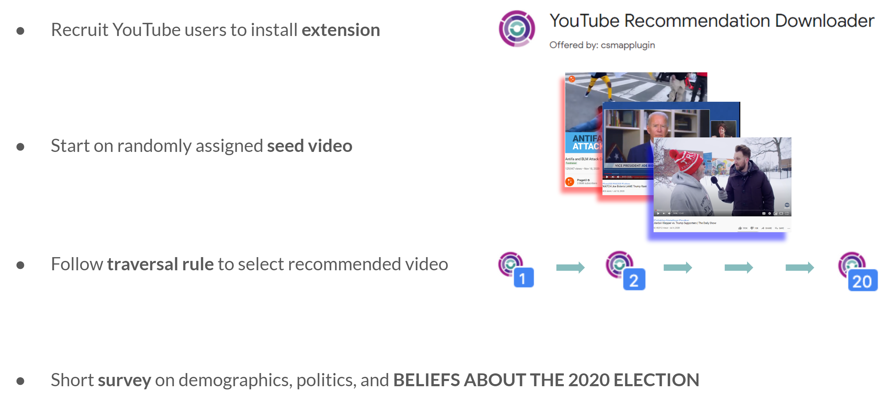</center>

---

# .blue[Research] Camp

<ol start = 3>

<li> **.red[Data Collection / Wrangling]** &rarr; **.red[Analysis]**

--

- Analysis is informed by the .red[data] you have collected...

- ...and the .blue[hypotheses] you have generated

--

<center>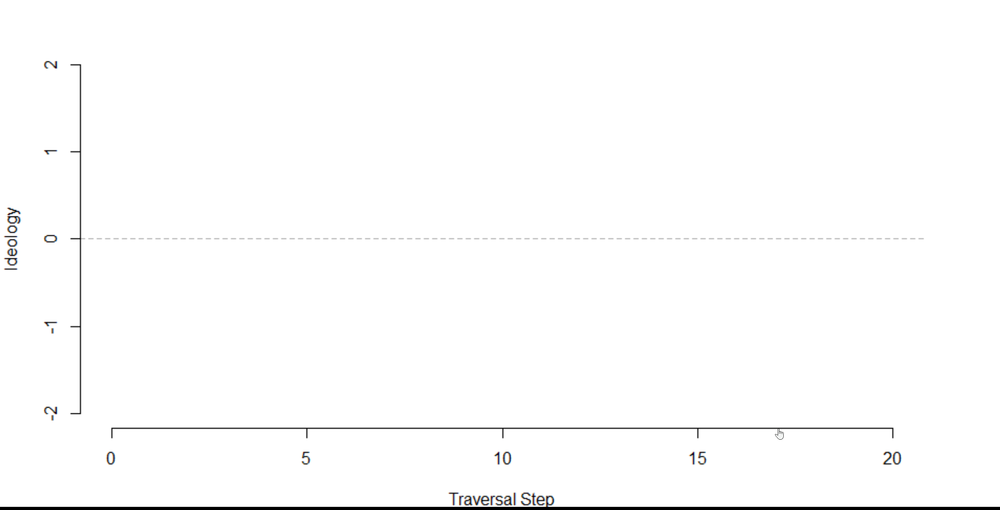</center>

---

# .blue[Research] Camp

<ol start = 3>

<li> **.red[Data Collection / Wrangling]** &rarr; **.red[Analysis]**

- Analysis is informed by the .red[data] you have collected...

- ...and the .blue[hypotheses] you have generated

<center></center>

---

# .blue[Research] Camp

<ol start = 3>

<li> **.red[Data Collection / Wrangling]** &rarr; **.red[Analysis]**

- Analysis is informed by the .red[data] you have collected...

- ...and the .blue[hypotheses] you have generated

<center>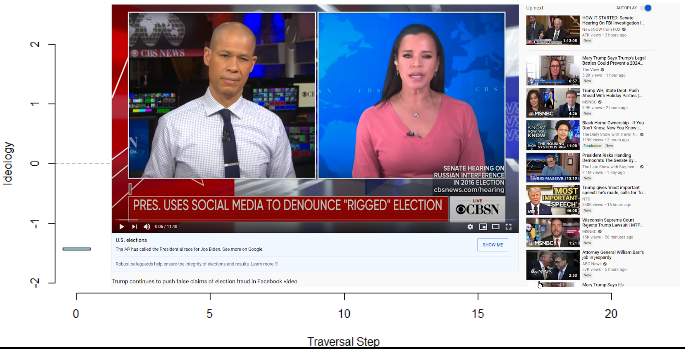</center>

---

# .blue[Research] Camp

<ol start = 3>

<li> **.red[Data Collection / Wrangling]** &rarr; **.red[Analysis]**

- Analysis is informed by the .red[data] you have collected...

- ...and the .blue[hypotheses] you have generated

<center>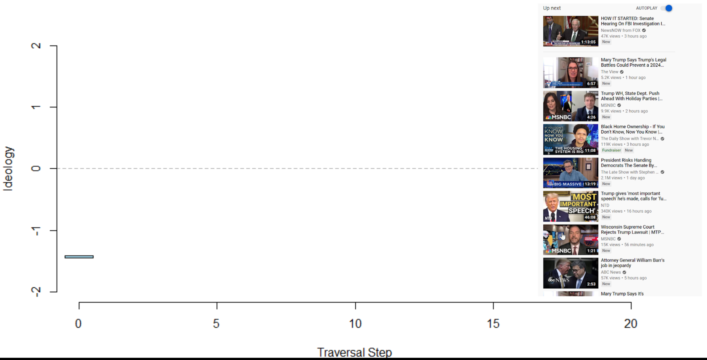</center>

---

# .blue[Research] Camp

<ol start = 3>

<li> **.red[Data Collection / Wrangling]** &rarr; **.red[Analysis]**

- Analysis is informed by the .red[data] you have collected...

- ...and the .blue[hypotheses] you have generated

<center>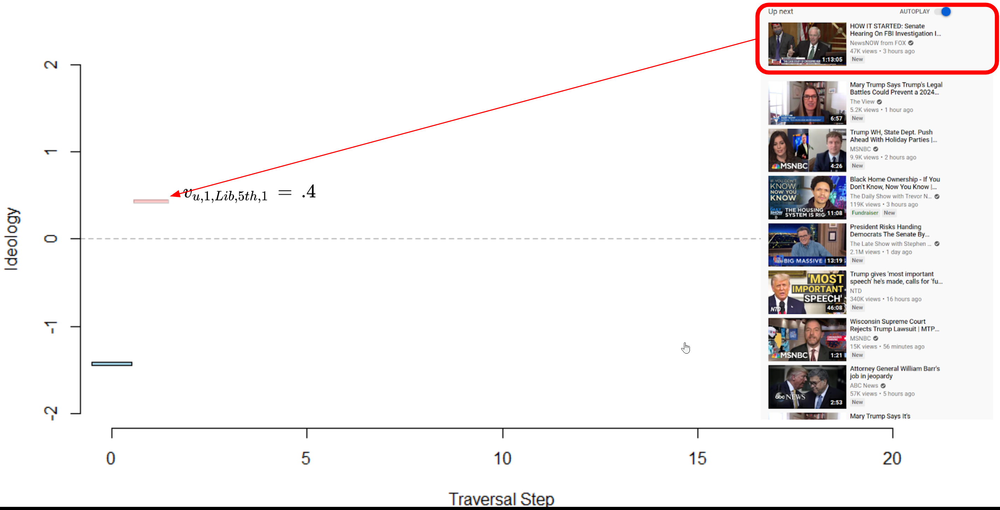</center>

---

# .blue[Research] Camp

<ol start = 3>

<li> **.red[Data Collection / Wrangling]** &rarr; **.red[Analysis]**

- Analysis is informed by the .red[data] you have collected...

- ...and the .blue[hypotheses] you have generated

<center>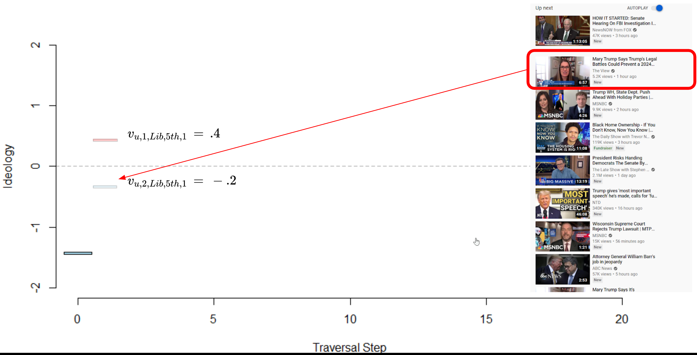</center>

---

# .blue[Research] Camp

<ol start = 3>

<li> **.red[Data Collection / Wrangling]** &rarr; **.red[Analysis]**

- Analysis is informed by the .red[data] you have collected...

- ...and the .blue[hypotheses] you have generated

<center></center>

---

# .blue[Research] Camp

<ol start = 3>

<li> **.red[Data Collection / Wrangling]** &rarr; **.red[Analysis]**

- Analysis is informed by the .red[data] you have collected...

- ...and the .blue[hypotheses] you have generated

<center></center>

---

# .blue[Research] Camp

<ol start = 3>

<li> **.red[Data Collection / Wrangling]** &rarr; **.red[Analysis]**

- Analysis is informed by the .red[data] you have collected...

- ...and the .blue[hypotheses] you have generated

<center>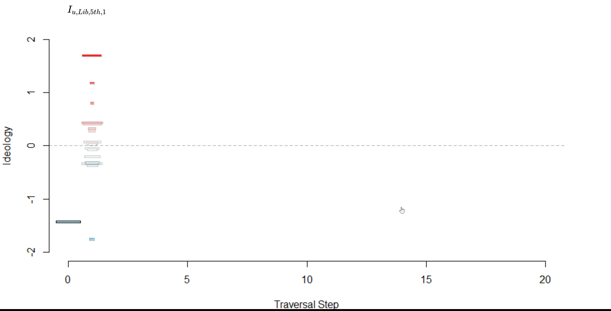</center>

---

# .blue[Research] Camp

<ol start = 3>

<li> **.red[Data Collection / Wrangling]** &rarr; **.red[Analysis]**

- Analysis is informed by the .red[data] you have collected...

- ...and the .blue[hypotheses] you have generated

<center></center>

---

# .blue[Research] Camp

<ol start = 3>

<li> **.red[Data Collection / Wrangling]** &rarr; **.red[Analysis]**

- Analysis is informed by the .red[data] you have collected...

- ...and the .blue[hypotheses] you have generated

<center>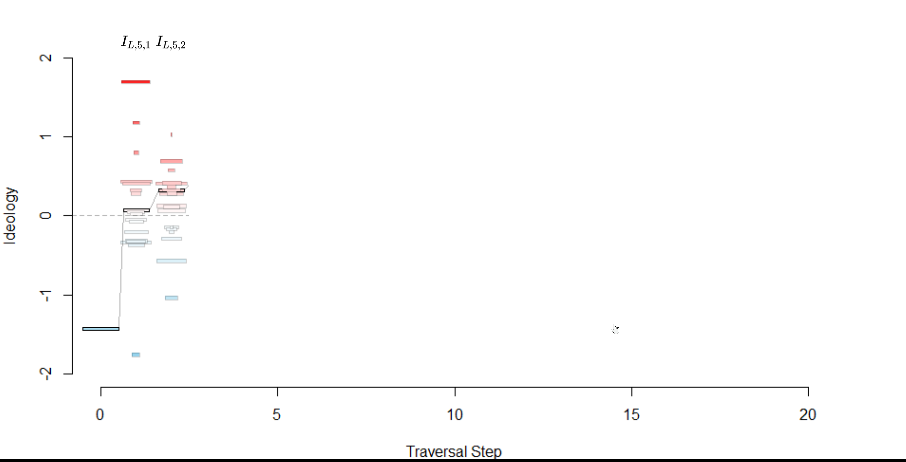</center>

---

# .blue[Research] Camp

<ol start = 3>

<li> **.red[Data Collection / Wrangling]** &rarr; **.red[Analysis]**

- Analysis is informed by the .red[data] you have collected...

- ...and the .blue[hypotheses] you have generated

<center>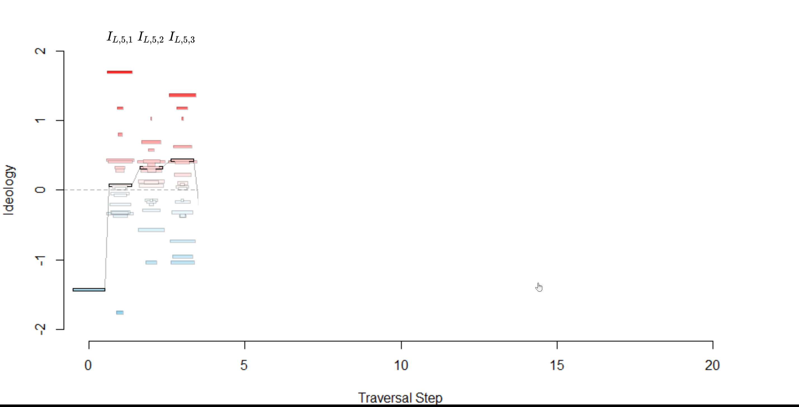</center>

---

# .blue[Research] Camp

<ol start = 3>

<li> **.red[Data Collection / Wrangling]** &rarr; **.red[Analysis]**

- Analysis is informed by the .red[data] you have collected...

- ...and the .blue[hypotheses] you have generated

<center>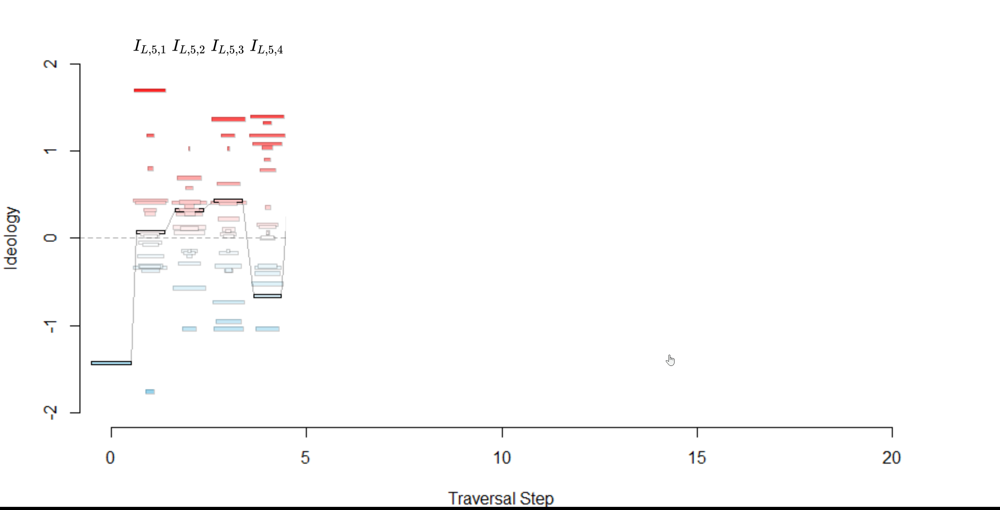</center>

---

# .blue[Research] Camp

<ol start = 3>

<li> **.red[Data Collection / Wrangling]** &rarr; **.red[Analysis]**

- Analysis is informed by the .red[data] you have collected...

- ...and the .blue[hypotheses] you have generated

<center></center>


---

# .blue[Research] Camp

<ol start = 4>

<li> **.red[Results]** &rarr; **.blue[Conclusion]**

  - Results fall out naturally from the analysis...
  
  - ...and must be interpreted in terms of the theory and hypotheses...
  
  - ...to draw conclusions

<center>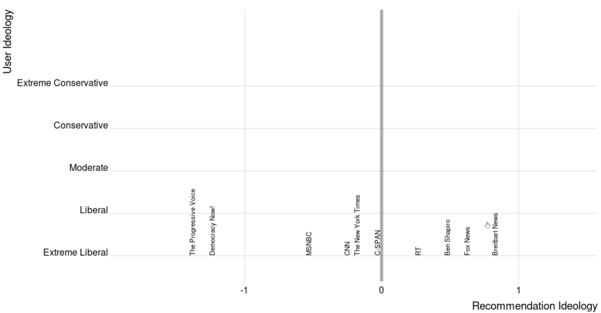</center>

---

# .blue[Research] Camp

<ol start = 4>

<li> **.red[Results]** &rarr; **.blue[Conclusion]**

  - Results fall out naturally from the analysis...
  
  - ...and must be interpreted in terms of the theory and hypotheses...
  
  - ...to draw conclusions

<center>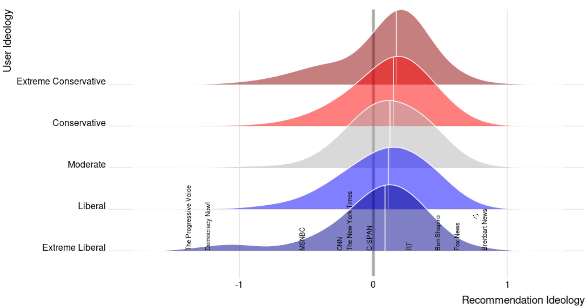</center>

---

# The Two Camps

<center></center>

---

# .red[Prediction] Camp

- **Goal/Problem/Challenge**: Measure the ideology of a YouTube video

---

# .red[Prediction] Camp

- **Data Wrangling**: Get matrix of links shared on political subreddits

--

<center>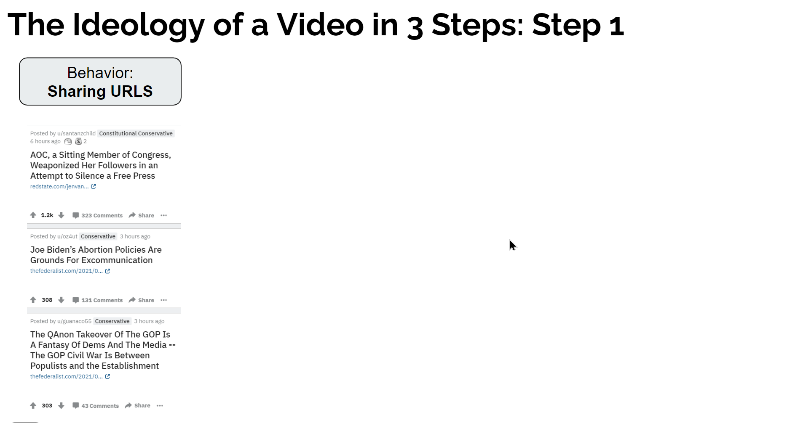</center>

---

#.red[Prediction] Camp

- **Data Wrangling**: Get matrix of links shared on political subreddits

<center>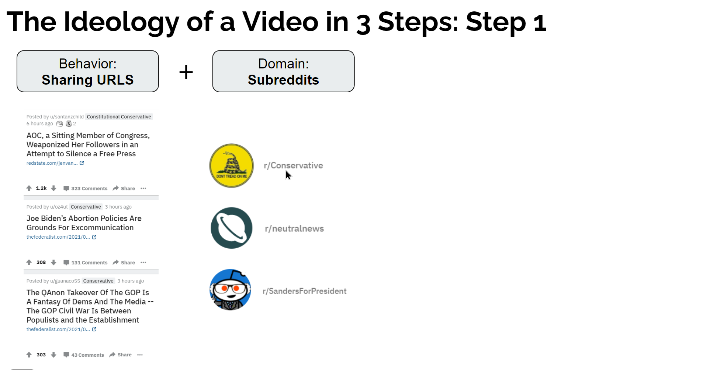</center>

---

#.red[Prediction] Camp

- **Data Wrangling**: Get matrix of links shared on political subreddits

<center>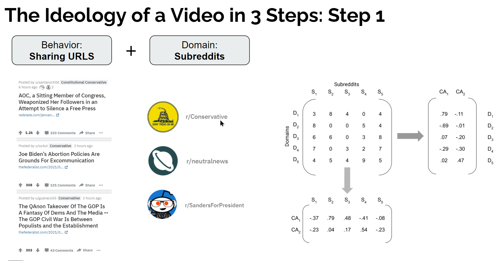</center>

---

#.red[Prediction] Camp

- **Data Wrangling**: Correspondence Analysis to estimate ideology scores for subreddits

<center>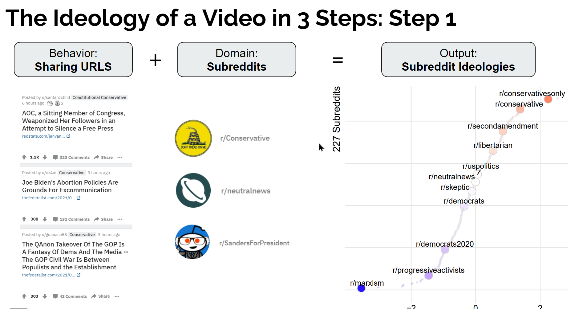</center>

---

#.red[Prediction] Camp

- **Data Wrangling**: Get matrix of YouTube videos shared on scored subreddits

<center></center>

---

#.red[Prediction] Camp

- **Data Wrangling**: Get matrix of YouTube videos shared on scored subreddits

<center>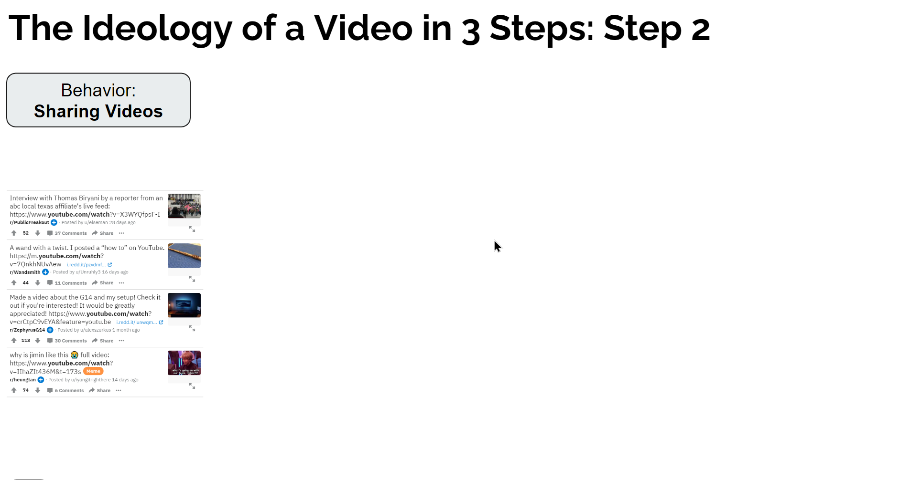</center>

---

#.red[Prediction] Camp

- **Data Wrangling**: Get matrix of YouTube videos shared on scored subreddits

<center>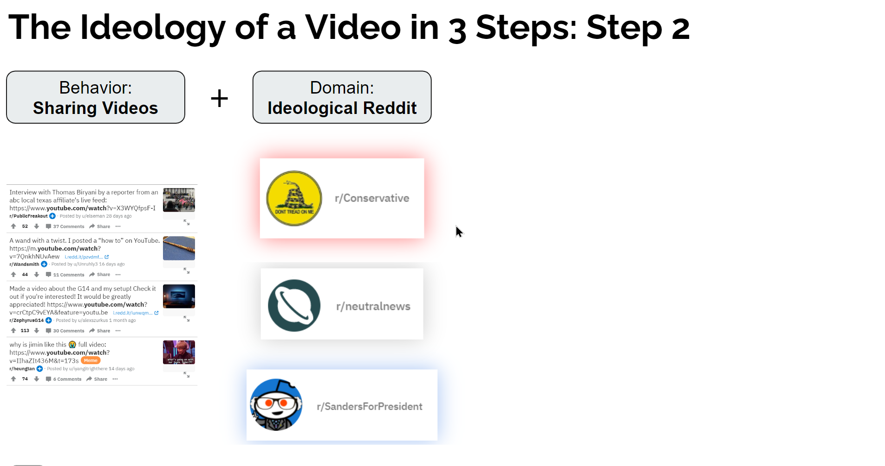</center>

---

#.red[Prediction] Camp

- **Data Wrangling**: Get matrix of 60k YouTube videos shared on scored subreddits

<center></center>

---

#.red[Prediction] Camp

- **Data Wrangling**: Calculate video ideology as weighted mean of subreddits

<center></center>

---

#.red[Prediction] Camp

- **Model Training**: BERT transformer trained on 60k videos

<center></center>

---

#.red[Prediction] Camp

- **Prediction**: Measure the ideology of a YouTube video

<center>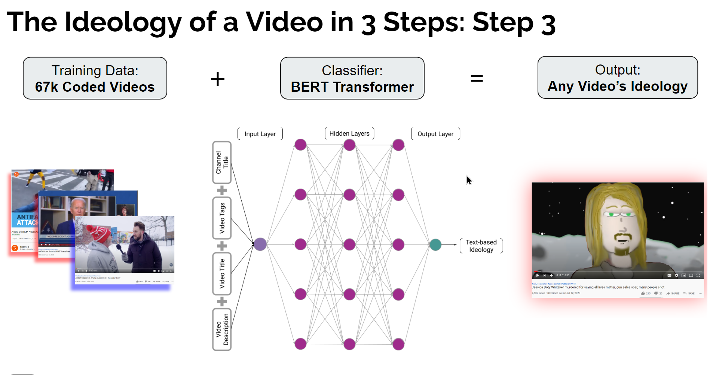</center>


---

# Course Objectives

- This course is the menu, not the food

--

  - Look over many different fields, methods, and tools

--

  - You pick those you like, and take more advanced classes to dig into them

--

- But we are very **hands on**

---

# Learning goals

1. Generate a sophisticated research question based on clearly described assumptions and a narrowly defined hypothesis.

--

2. Describe the data used to investigate this research question, including univariate and multivariate visualizations and summary statistics.

--

3. Apply the appropriate methods to answer the research question and evaluate the hypothesis.

--

4. Acknowledge limitations of method and results, and describe a superior empirical setting that would overcome these limitations.


---

# ChatGPT in the classroom

- Are we at the precipice of a new era in human-computer relations?

--

  - ChatGPT can achieve these learning goals!
  
--

  - But it needs to be used wisely...it is still a tool
  
--

- It can make coding (the hardest part of this class) easier

--

- But it can also prevent you from learning

---

# AI in the labor market

- McKinsey told AT&T in 1980 that, by 2000, cell phones would be a niche market of 900,000 subscribers

--

- Is AI-assisted work is the future?

--

  - Profound gains in productivity already

--

- Will this be like automation and globalization for US manufacturing?
  
--

  - What skills will be valuable in 5 years? 10 years?
  
---

# AI in the labor market

--

- My answer: prepare you for both possibilities

--

  - If AI is a "fad", make sure you can do this work unassisted
  
  - If AI is the new normal, make sure you can work with it productively
  
--

- The one thing you **shouldn't** do

--

  - Take shortcuts / cheat
  
--

- You will still have an interview in which you are asked something like the following: "How is overfitting different from underfitting, and why should we care?"

--

  - **You** need to know this answer


---

# Grades: PSets

- 6 in total

--

- Posted to **Github**

--

- Due

  - Psets 1, 3, 4 and 6 due following Thursday at start of class
  
  - Psets 2 and 5 due following Monday at start of class
  
--

- Restrictions:

  - Open book / open note / open Campuswire

  - Can collaborate but submissions must be your own
  
--

- **Must submit a record of ChatGPT work with the problem set**
  
---

# Grades: Exams

- 2 in total: midterm on July 11th, final on July 25th

--

- Midterm is 15% of final grade

- Final (cumulative) is 20% of final grade


---

# Grades: Attendance

- Taken at beginning of each lecture

- 16 meetings but only 14 count toward grade

  - 0.36 points per attendance
  
- **Don't miss the midterm or the final!!**

---

# Not Graded: HW

- You should work through the homeworks prior to each lecture

--

- Open the `.Rmd` file and Knit it

--

- Read the output and try and answer the prompts

--

- **Not graded**, but enormously helpful in preparing you to keep up with lectures


---

# Honor Code

- My policy: Academic misconduct includes, but is not limited to, cheating, fabrication, plagiarism, altering graded examinations for additional credit, having another person take an examination for you, falsification of results, or facilitating academic dishonesty or as further specified in the university policy found at the website above. These and other forms of cheating are all potentially grounds for penalties including failure of the assignment or the course, as well as program- or university-level disciplinary action.

---

# Honor Code

- Violations of this policy may result in:

--

  - An F for the class (at minimum)
  
  - Suspension for a semester
  
  - Expulsion
  
--

- However, except where **explicitly noted**, this course is collaborative

--

  - Open book, open note, open internet
  
  - Can rely on Campuswire for help
  
  - Can work together on problem sets (but must submit own work)
  
--

- **Can't collaborate on exams**

---

# Resources

- Campuswire (place for **questions**)

  - Post questions on the class feed
  
--

- GitHub (place for **materials**)

  - Find all in-class materials
  
--

- TA recitations / labs (place for **hands-on help**)

- Office hours (place for **hands-on help**)
  
---

# Teaching Philosophy

<center>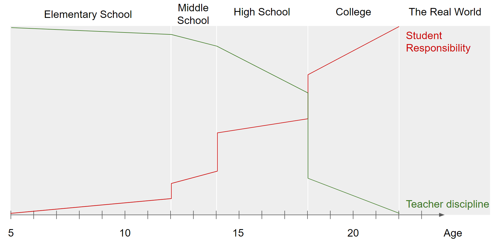</center>

---

# Teaching Philosophy

- This course is **inherently** hard

--

  - Learning `R` is challenging
  
--

- But the goal is to **encourage** you to pursue data science

--

- As such, the **nature** of the material is at odds with the **goal** of the class

--

- My solution: grade leniently

--

  - I.e., lots of extra credit

---

# BREAK

---

# Agenda

1. Getting set up

--

  - Folder structure + `setwd()`
  
--

2. Installing software

--

  - [`R: https://cran.r-project.org/`](https://cran.r-project.org/)
  
--

  - [`RStudio: https://rstudio.com/products/rstudio/download/`](https://rstudio.com/products/rstudio/download/)

--

3. Requiring packages

--

  - `install.packages("tidyverse")` 

--

  - `require(tidyverse)`
  
--

4. Loading and manipulating data

--

  - `readRDS()`
  
--

  - `%>%`

---

# Getting set up

--

- Folder structure + `setwd()`

--

  - Concept: keep everything together...
  
--

  - ...and **related**

--

.center[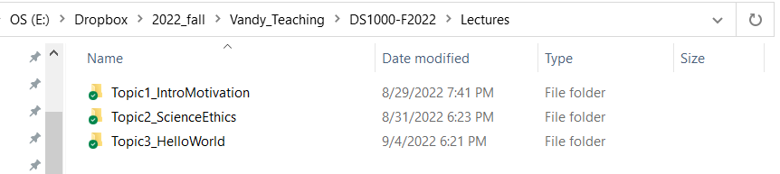]


---

# Getting set up

- Folder structure + `setwd()`

  - Concept: keep everything together...

  - ...and **related**

.center[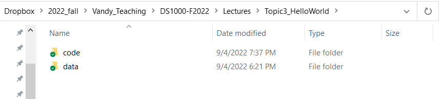]


---

# Installing software

--

- [`R: https://cran.r-project.org/`](https://cran.r-project.org/)

  - Accept all defaults
  
--

- [`RStudio: https://rstudio.com/products/rstudio/download/`](https://rstudio.com/products/rstudio/download/)

  - Download the version for your OS
  
--

- Open `RStudio` and create a new rmarkdown (`.Rmd`) file

--

  - Accept defaults, give it a sensible name, delete the default text, then save it to your folder (again with a sensible name)
  
--

  - You should follow along with the lecture in this file! Take notes here! Try code here!

---

# How to type in `.Rmd`
````{verbatim, lang = "markdown"}
# This is a header

## This is a subheader

### This is a subsubheader

This is plain text.
````
--

# This is a header

## This is a subheader

### This is a subsubheader

This is plain text.


---

# How to type in `.Rmd`
````{verbatim, lang = "markdown"}
- This is

- a bulleted

  - List

1. This is

2. a numbered list
````

--

- This is

- a bulleted

  - List

1. This is

2. a numbered list

---

# How to type in `.Rmd`

```{verbatim, lang = "markdown"}
**Bold font**, *italic font*, `code font`
```
--

**Bold font**, *italic font*, `code font`

--

- Most Importantly! `R` code!

````{verbatim,lang = "markdown"}
```{r}
2+2
```
````

--

```{r}
2+2
```

---

# How `R` Works

--

- **O**bject **O**riented **L**anguage (**OOL**)

--

  - Objects are created with the `<-` command
  
--

  - You *can* run code directly...
  

```{r}
2+2
```

---

# How `R` Works


- **O**bject **O**riented **L**anguage (**OOL**)

  - Objects are created with the `<-` command

  - ...but most of what we'll do involves objects
  

```{r}
object1 <- 2+2
```

--

- Object assignment operator **saves** the output

- It **does not print** the output

--

- To see, just call the object

```{r}
object1
```

---

# How `R` Works


- **O**bject **O**riented **L**anguage (**OOL**)

  - Objects are created with the `<-` command

  - They can be named anything (so be intuitive!)
  

```{r}
three_plus_three <- 2+2
three_plus_three
```

---

# How `R` Works

- **O**bject **O**riented **L**anguage (**OOL**)

  - Objects are created with the `<-` command

  - Objects can store many different things
  
```{r}
an_element <- 2+2
a_vector <- c(1,2,3)
a_list <- list('element1' = 2+2,
               'element2' = "hello world!",
               'element3' = runif(n = 10,min = 0,max = 10))
a_function <- function(x) {
  avg_of_x <- sum(x) / length(x)
  return(avg_of_x)
}
```

---

# How `R` Works

- Objects **persist!**
```{r}
an_element # This object stores 2+2
a_vector   # This object stores the integers 1, 2, and 3

an_element*a_vector
an_element-a_vector
```

---

# A comment on comments

- If you use a # sign inside a code chunk, you can write a comment

```{r}
# This is a comment. If I compile the code, nothing will happen.

# This is another comment. These are helpful for annotating my code.
```

---

# How `R` Works

- Objects **persist!**
```{r}
# This object stores:
  # 1) 2+2 (named "element1")
  # 2) the text "hello world!" (named "element2")
  # 3) 10 numbers randomly drawn between 0 and 10
a_list
```

---

# How `R` Works

- Objects **persist!**
```{r}
# Let's apply our function ("a_function") to "element3" in "a_list"
a_function(x = a_list[['element3']])
```

--

- We could also call `element3` from `a_list` with a dollar sign

```{r}
# This does the same thing as the previous slide...it just accesses element3 differently.
a_function(x = a_list$element3)
```

---

# How `RStudio` Works

--

- `RStudio` is a powerful way to interact with `R`

--

- In base `R`, you interact with the program via the "command line"

--

  - For example...
  
--

- But to save your work, you can write "scripts"

--

  - For example...
  
--

- *This is all cumbersome!*

--

- Enter, `RStudio`

---

# How `RStudio` Works

--

- `RStudio` allows us to:

--

  1. Write scripts
  2. Run scripts
  3. See results

--

- It is **deeply interactive**

--

  - We can highlight a line and press `ctrl+enter` / `cmd+enter` and see the result
  
--

  - **We can even do this with single objects!**
  
---

# Give it a try

- Comment **everything**

--

- Create two objects

  - `a` contains the product of 3 and 5 (`3*5`)
  
  - `b` contains five numbers `c(10,21,43,87,175)`
  
--

- Now create object `c` which is `a - b`

```{r}
# INSERT CODE HERE
```

---

# Functions & Packages

--

- What are `packages`?

--

  - Basically, **functions** that someone else wrote
  
--

- `R` has many functions already installed

--

  - These are known as "base `R`" and contain many useful functions

--

  - For example, `sum()` will add up a vector of numbers

--

```{r,echo=TRUE,eval=FALSE}
sum(object1)
```
  
--

  - Quiz: What does the `mean()` function do? The `median()`? The `range()`?
  
--

- Other base `R` functions interact with other files

--

  - For example, `read.csv()` will load a `.csv` file
  
--

- And there are MANY **MANY** more

---

# Installing Packages

--

- In addition to the functions included in base `R`, we want more

--

- For this class, we want one called `tidyverse`

--

  - `tidyverse` contains many (hundreds?) of functions that make `R` easier
  
--

  - But it is NOT included in the base `R` set of functions
  
--

  - Therefore, we need to add it
  
--

- Use the base `R` function `install.packages("[PACKAGE NAME]")`

--

  - Specifically, `install.packages("tidyverse")`
  
---

# Requiring Packages

--

- Once installed, a package will live somewhere on your computer

--

- However, any new *instance* of `R` will not automatically load the packages

--

- We need to `require()` them to tell `R` to load them

--

  - Alternatively, we can use `library()` (but it's the same result)
  
--

- So load the `tidyverse` package with `require(tidyverse)`

```{r,echo=FALSE,warning=FALSE,message=FALSE}
require(tidyverse)
```

--

  - NB: you need quotes for the `install.packages()` function...
  
--

    - i.e., `install.packages("tidyverse")`
    
--

  - but NOT for the `require()` function
  
--

    - i.e., `require(tidyverse)`
  
---

# Loading Data

--

- So you should be using `R` via `RStudio` with the `tidyverse` package loaded

--

- Now let's load some data

--

- You can save it locally from the course  [github page](https://github.com/jbisbee1/ISP_Data_Science_2024/blob/main/data/sc_debt.Rds) and then load it from your computer
  
--

- Or you can load it directly from the internet with the `read_rds()` function from `tidyverse`

--

  - NB: `R` is an "object-oriented language" (OOL)

--

  - We **create** an "object" to store the data using a left-arrow: `<-`

--

```{r}
df <- read_rds('https://github.com/jbisbee1/ISP_Data_Science_2024/raw/main/data/sc_debt.Rds')
```


---

# Loading Data

--

- We now have the contents of `sc_debt.Rds` stored in the object `df`

--

  - This is a "tabular data frame", aka a `tibble`
  
  - **Rows** are observations
  
  - **Columns** are values

--

- We can look at this object directly

```{r}
df
```

---

# Loading Data

--

- Or we can look at its columns

```{r}
names(df)
```

---

# Loading Data

--

```{r,echo=FALSE,message=FALSE}
defs <- data.frame(Name = names(df),
                   Definition = c('Unit ID','Institution Name','State Abbreviation','Median Debt of Graduates',
                            'Control Public or Private','Census Region','Predominant Degree Offered: Assocates or Bachelors',
                            'Open Admissions Policy: 1=Yes, 2=No, 3=No 1st time students',
                            'Admissions Rate: proportion of applications accepted','Type of institution*',
                            'Average SAT scores',
                            'Average Earnings of Recent Graduates',
                            'Number of undergraduates',
                            'Average cost of attendance (tuition-grants)',
                            'Institution admits fewer than 10% of applications, 1=Yes, 0=No',
                            'Institution is a research university, 1=Yes, 0=No'))
```

```{r,echo=FALSE,warning=FALSE,message=FALSE}
require(kableExtra)
defs %>%
  kbl() %>%
  kable_paper("hover", full_width = F,font_size = 13)
```
&ast;<font size="2">See [here](https://data.ed.gov/dataset/9dc70e6b-8426-4d71-b9d5-70ce6094a3f4/resource/658b5b83-ac9f-4e41-913e-9ba9411d7967/download/collegescorecarddatadictionary_01192021.xlsx)</font>

---

# Manipulating the Data

--

- These data are cool!

--

- But TMI at first

--

- I want to know...

--

  - Where is `Vanderbilt University`?
  
--

  - Who is the most selective?
  
--

  - Which schools produce the richest grads?
  
--

- There are `tidyverse` functions to answer all of these questions

---

# Manipulating with `tidyverse`

- The code process of `tidyverse` relies on a "pipe" symbol: `%>%`

--

  - I don't like this name
  
  - I think it should be called a "chain" because it **links code together**
  
  - Or maybe a "do" symbol because it tells `R` what to do
  
--

- The basic grammar of `R` is: object, `%>%`, verb

```{r,eval=FALSE}
object %>%  # This is the object
   function() # This is the verb
```

---

# Manipulating with `tidyverse`

- `tidyverse` has many useful "verbs" (i.e., functions)

  - `filter()`: subsets **rows**
  
  - `select()`: subsets **columns**
  
  - `arrange()`: sorts **rows** based on **columns**
  
  - `summarise()`: collapses **rows**
  
  - `group_by()`: groups **rows** by **columns**
  
---

# Manipulating: `filter()`

- So let's look at Vandy

--

- `filter` will select **rows** of the data based on some criteria

--

```{r}
df %>%
  filter(instnm == "Vanderbilt University") # Only select rows with Vandy
```

---

# Manipulating: `select()`

- Still TMI!

--

- I only care about the admissions rate (`adm_rate`), the SAT scores (`sat_avg`), and the future earnings (`md_earn_wne_p6`)

--

- `select` will select **columns**

```{r}
df %>%
  filter(instnm == "Vanderbilt University") %>%
  select(instnm,adm_rate,sat_avg,md_earn_wne_p6) # Only select four columns
```

---

# Manipulating: `arrange()`

- How does Vandy compare...?

--

  - to other schools in terms of SAT scores?
  
  - to other schools in terms of future earnings?
  
  - to other schools in terms of admissions rates?

--

- `arrange` will sort the data based on a column (ascending!)

```{r}
df %>%
  arrange(sat_avg) %>% # Sort data by SAT scores
  select(instnm,sat_avg) # Only look at name and SAT scores
```

---

# Manipulating: `arrange()`

- Vandy is not in the bottom 10 schools

```{r}
df %>%
  arrange(sat_avg) %>% # Sort data by SAT scores
  select(instnm,sat_avg) # Only look at name and SAT scores
```

---

# Manipulating: `arrange()`

- Use `desc()` to order in descending values...Vandy not in top 10 either

```{r}
df %>%
  arrange(desc(sat_avg)) %>% # Sort data by SAT scores (descending)
  select(instnm,sat_avg) # Only look at name and SAT scores
```

---

# Manipulating: `arrange()`

- What if we look only at "selective" schools (i.e., those who accept less than 10% of applicants)?

--

```{r}
df %>%
  filter(adm_rate < .1) %>% # Only look at schools who accept less than 10%
  arrange(sat_avg,adm_rate) %>% # Sort data by SAT scores AND THEN admissions rates (breaks ties)
  select(instnm,adm_rate,sat_avg) # Only look at name, admissions rate, and SAT scores
```


---

# How does Vandy compare?

--

- `arrange` in descending order

```{r}
df %>%
  filter(adm_rate < .1) %>%
  arrange(desc(sat_avg),adm_rate) %>%
  select(instnm,adm_rate,sat_avg)
```


---

# More complicated? More `%>%`!

--

- Less selective schools by SAT with debt and state

```{r}
df %>%
  filter(adm_rate > .2 & adm_rate < .3) %>% # Less selective schools (accept between 20% and 30%)
  arrange(stabbr,desc(sat_avg)) %>% # Sort by state name, then by SAT scores
  select(instnm,sat_avg,grad_debt_mdn,stabbr) # Only look at some columns
```

---

# A quick aside on missingness

--

- Some rows have `NA` in some columns

--

  - `NA` is the standard code for **missing data** in `R`
  
  - Data can be missing for many different reasons (i.e., some schools don't require SAT scores or record them)
  
  - We can use a base `R` function called `is.na()` which will be `TRUE` if the value is `NA` or `FALSE` otherwise
  
--

  - And we can combine `is.na()` with the `filter()` function from `tidyverse`

--

- We will return to this in the lectures on **data wrangling**
  
--

- For now, how many schools don't report SAT scores?

```{r}
df %>%
  filter(is.na(sat_avg)) %>% # Only look at schools that DON'T report SATs
  select(instnm,stabbr) # Only look at the name and the state
```


---

# Stepping back

--

- Thus far, lots of .red[data]

--

- Not a lot of .blue[science]

--

- But remember the .blue[Research] camp!

--

  1. .red[Observation] &rarr; .blue[Question]

  2. .blue[Theory] &rarr; .blue[Hypothesis]

  3. .red[Data Collection / Wrangling] &rarr; .red[Analysis]

  4. .red[Results] &rarr; .blue[Conclusion]
  
--

- We have been doing lots of .red[Observation]!

--

- Do we have any good .blue[Research questions]?

---

# Stepping back

- .blue[RQ]: How might admissions and SAT scores be **related**?

--

  - .blue[Theory]: selective schools have stricter criteria
  
--

  - .blue[Hypothesis]: admissions and SAT scores should be **negatively** related
  
--

- How can we test this hypothesis?


---

# Summarizing Data: `summarise()` + `mean()`

--

- We can combine base `R` functions with `tidyverse` functions!

--

  - Base `R`: `mean()`
  
  - `tidyverse`: `summarise()` (aka `summarize()`)
  
- Overall average SAT scores

```{r}
df %>%
  summarise(mean_sat = mean(sat_avg,na.rm=T)) # Average SAT scores for entire data
```

---

# Summarizing Data

--

- Let's unpack this

```{r,eval=F}
df %>%
  summarise(mean_sat = mean(sat_avg,na.rm=T))
```

--

  - Create new variable `mean_sat` that contains the `mean()` of every school's average SAT score
  
--

  - `na.rm=T` means we want to ignore missing data. If not?
  
--
  
```{r,eval=T}
df %>%
  summarise(mean_sat = mean(sat_avg))
```

---

# Summarizing Data

--

- Recall we want see if more selective schools have higher SAT scores

--

```{r,eval=T}
df %>%
  filter(adm_rate < .1) %>% # Only look at schools who accept less than 10% of applicants
  summarise(mean_sat_LT10 = mean(sat_avg,na.rm=T)) # Calculate the average SAT score
```

```{r,eval=T}
df %>%
  filter(adm_rate > .1) %>% # Only look at schools who accept more than 10% of applicants
  summarise(mean_sat_GT20 = mean(sat_avg,na.rm=T)) # Calculate the average SAT score
```

---

# Summarizing Data: `group_by()`

--

- One final `tidyverse` function: `group_by()`

--

- There is a column called `selective` which is either 1 or 0

--

  - 1: the admissions rate is less than 10%
  
  - 0: otherwise
  
--

```{r}
df %>%
  select(instnm,selective,adm_rate)
```

---

# Summarizing Data: `group_by()`

- Instead of running two separate `filter()` commands, use `group_by()`

--

```{r,eval=T}
df %>%
  group_by(selective) %>% # Group the data by selective (either 1 or 0)
  summarise(mean_sat = mean(sat_avg,na.rm=T)) # Calculate average SAT for each group
```

---

# Results

- Do more selective schools have higher SAT scores?

--

- Yes

--

- This .red[Result] **confirms** our .blue[Hypothesis] and **answers** our .blue[Research Question]

---

# Conclusion

--

- What we've done today is a microcosm of data science

--

  1. Opened .red[data] (`readRDS`)
  
--
  
  2. Looked at .red[data] (`tidyverse` + `select()`, `filter()`, `arrange()`)
    
--

  3. Generated .blue[hypotheses] (Admissions versus SAT scores)
  
--

  4. .red[Tested] .blue[hypotheses] (`summarise()` + `mean()`)
