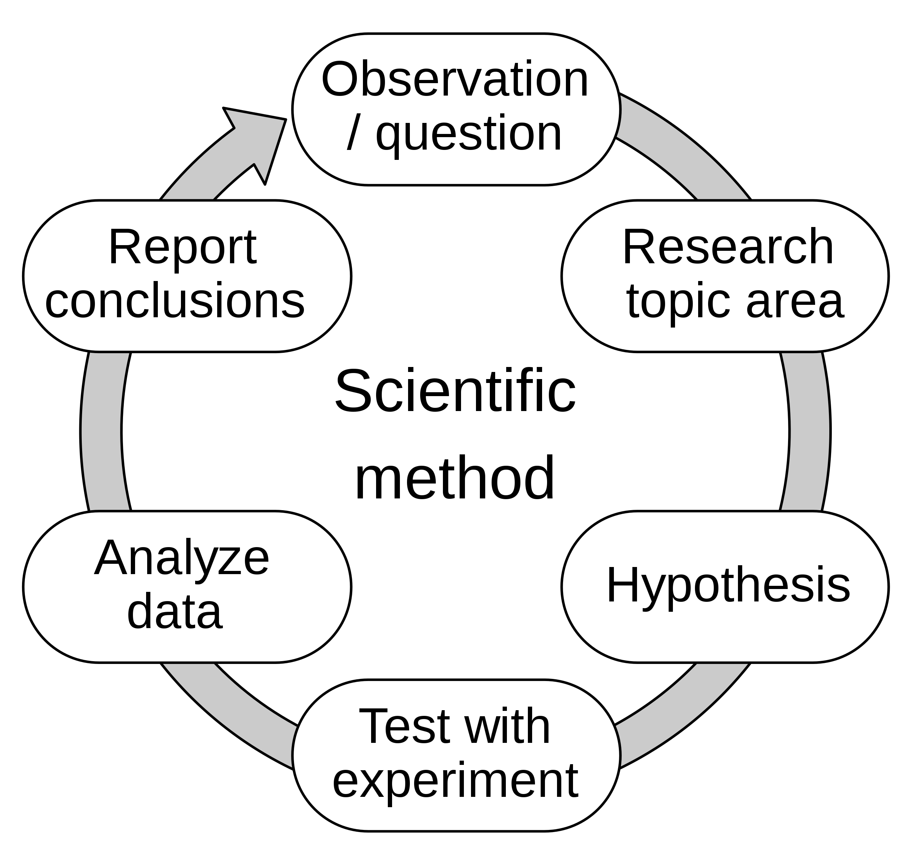

```{r,include=F}
options(width=60)
knitr::opts_chunk$set(fig.align='center',fig.width=9,fig.height=5,dev = 'svg')
```

---

# Univariate Analysis

1. Definitions and scope

2. Opening and defining the data

3. Variable classes

4. Univariate description

BREAK

5. Multivariate

---

# Definition

--

- .red[Uni] + .blue[variate]

--

  - .red[One] + .blue[variable]
  
--

  - Analysis of one variable
  
---

# Scope

- How to analyze a single variable?

--

- How to think .blue[scientifically]?

--

  - Typically, scientific theories concern more than one variable
  
--

  - I.e., education + wages; gender + voting

--

  - What might be a theory about education in isolation?
  
--

- Is there no point to univariate analysis?

---

# Univariate Analysis is **ESSENTIAL**

--

- Both from a .red[practical data] perspective...

--

  - Informs how we "wrangle" the data

--

- ...and from a .blue[scientific theory] perspective

--

  - Generates hypotheses
  
--

<center></centering>

---

# Set-up and Load Data

--

- As always, create your topic folder first

<center></center>

--

- Open `R` via `RStudio` and `require(tidyverse)`

```{r,message = F}
require(tidyverse)
```

- Load data from [github](https://github.com/jbisbee1/ISP_Data_Science_2024/blob/main/data/nba_players_2018.Rds)

```{r}
nba <- read_rds('https://github.com/jbisbee1/ISP_Data_Science_2024/raw/main/data/nba_players_2018.Rds')
```

---

# Introducing the data

--

- Data on every NBA player active in the 2018-2019 season

--


| Name               |                          Definition |
|--------------------|------------------------------------:|
| namePlayer         |                         Player name |
| idPlayer           |                    Unique player id |
| slugSeason         |                Season start and end |
| numberPlayerSeason |        Which season for this player |
| isRookie           |        Rookie season, true or false |
| slugTeam           |                     Team short name |
| idTeam             |                      Unique team id |
| gp                 |                        Games Played |
| ...                |                                 ... |


---

# Thinking like a .blue[scientist]

--

- What questions do we have? What hypotheses might we want answered?

--

- Overwhelming? Let's start simpler

--

- Total points (`pts`)

--

  - What does this measure?
  - What kind of variable is it?

```{r}
glimpse(nba %>% select(pts))
```


---

# Thinking like a .blue[scientist]

- How can we analyze a single variable?

--

- Want to **summarize** it somehow

--

  - For example, look at the `mean()` and the `median()`
  
```{r}
nba %>%
  summarise(mean_pts = mean(pts,na.rm=T),
            med_pts = median(pts,na.rm=T))
```

---

# Thinking like a .blue[scientist]

- Or we could summarise the overall distribution with `summary()`

--

```{r}
summary(nba$pts)
```

--

- In English:

--

  - There is at least one player who didn't score at all (`Min.`)
  
  - At least one player scored 2,818 points (`Max.`)
  
  - 25% of players scored less than 115 points (`1st Qu.`)
  
--

  - 25% of players scored more than ???
  
--

- What does a decimal mean here?
  
---

# Visualization

--

- We could try and remember all these statements

--

- Or we could just visualize the data

--

```{r,fig.height=4,fig.width=9,warning=F,message=F}
nba %>%
  ggplot(aes(x = pts)) + 
  geom_histogram()
```

---

# Visualization

- Plotting the histogram reveals some things!

--

  - There are **MANY** players who didn't score any points
  - There are **VERY FEW** who scored many
  
--

- We can combine the substantive interpretation with the visualization by plotting vertical lines for the quartiles

--

  - A "quartile" is 25% increments
  
--

  - A "decile" is 10% increments, a "quantile" is 20% increments
  
--

  - A "percentile" is 1% increments

---

# Visualization

```{r,fig.height=5,fig.width=9,warning=F,message=F}
nba %>%
  ggplot(aes(x = pts)) + 
  geom_histogram() + 
  geom_vline(xintercept = quantile(nba$pts,c(.25,.5,.75))) #<<
```

---

# Visualization

- We can save and update plots using the object assignment operator `<-`

```{r}
p <- nba %>%
  ggplot(aes(x = pts)) + 
  geom_histogram()

p <- p + geom_vline(xintercept = quantile(nba$pts,c(.25,.5,.75)),linetype = 'dashed',color = 'red')

p <- p + xlab('Total Points') + ylab('Number of Players')

p <- p + theme(panel.background = element_rect(fill = 'white'))

p <- p + labs(title = 'Points by Players',subtitle = '2018-2019 NBA Season')
```

---

# Visualization

```{r,fig.height=6,fig.width=10,warning=F,message=F}
p
```

---

# Visualization informs .blue[science]

--

- Looking at the data can help generate research questions, theories, and hypotheses

--

  - **Question:** Why do some players not score any points?
  
--

  - **Theory:** Players need minutes to score points.
  
--

  - **Hypothesis:** The number of points a player scores should be positively correlated with their minutes.

---

# Univariate Description

--

- Testing this hypothesis comes later

--

- For now, let's also describe the minutes variable

```{r}
summary(nba$minutes)
```

--

  - At minimum, every player played at least 1 minute
  
--

  - Does the distribution of this variable look similar to the points?
  
---

```{r,fig.height=6,fig.width=10,warning=F,message=F}
nba %>%
  ggplot(aes(x = minutes)) + 
  geom_histogram(alpha = .3) + 
  geom_vline(xintercept = quantile(nba$minutes,c(.25,.5,.75))) + 
  labs(title = 'Minutes by Players',subtitle = '2018-2019 NBA Season',x = 'Minutes Played',y = 'Number of Players')
```

---

# Other Variables

--

- Thus far, `pts` and `minutes` are both `dbl`

```{r}
glimpse(nba %>% select(pts,minutes))
```

--

- What about other variable types?

---

# Other Variabes

```{r}
glimpse(nba)
```

---

# Categorical Variables

--

- Already introduced you to `dbl`, `fct`, `chr` and `int`

--

- Taking a step back: Outside `R`, data science uses "categorical" variables

--

  1. Mutually exclusive: observations can only be in one category
  2. Exhaustive: every observation is assigned to a category
  
--

- For example, `isRookie`

--

  1. Mutually exclusive: Players are either in their rookie season in 2018-2019, or are not
  2. Exhaustive: these categories define every player in the data
  
---

# Categorical Variables

- Categorical variables can be divided into the following sub-types

--

- **Ordered:** There is a sensible order (i.e., education)

--

  - Should be arranged intuitively (i.e., LTHS, HS Degree, Some coll, etc.)
  
--

  - To summarize, calculate the proportions for each category.
  
--

  - If there are too many categories, use the "mode"

  
---

# Categorical Variables

- Categorical variables can be divided into the following sub-types

- **Ordered, Binary:** An ordered categorical variable with just two levels

--

  - Should be arranged in intuitive order (i.e., is not a rookie / is a rookie)
  
--

  - To summarize, just convert to a [0,1] number and take the mean

---

# Categorical Variables

- Categorical variables can be divided into the following sub-types

- **Unordered**: No sensible order of categories (i.e., major degree)

--

  - Order by most commonly occurring categories
  
--

  - As before, use the mode for too many categories

---

# Categorical Variables

- Categorical variables can be divided into the following sub-types

- **Unordered, Binary**: No sensible order and only two levels (i.e., edible)

---

# Categorical Variables

- Categorical variables are meaningfully different from continuous variables

--

  - Continuous variables are ordered and can theoretically be divided into arbitrarily small measures
  
--

  - Technically can be defined as either **interval** or **ratio** variables
  
--

  - In practice, we rarely worry about this distinction, but we **DO** care about continuous versus categorical variables

---

# Categorical Variables

- `fct` is a class that is unique to `R`

--

  - Meant for ordered categorical variables
  
--

  - `fct` stores the order and assigns a numeric value + a definition
  
--

  - Most of the time, better to store as a `chr` (but not always)
  
---

# Variables

- `R` may store categorical variables as `chr`, `fct`, `lgl`, `int`, or even `dbl`

--

- Continuous variables typically stored as `int` or `dbl`

--

- Up to the data scientist to look at the data and determine

--

- Simple **process**

--

  1. Look at a few observations and make a guess about the variable type
  2. Create a plot or table based on that guess
  3. If the result is sensible, proceed. OTW go back to #1.
  
---

# In Practice

--

- Let's look at field goals (`fgm`)

--

- What type of variable should this be?

--

  - *Technically* not continuous, since it can't be divided into fractions (i.e., what is 35.5 field goals?)
  
--

  - But we typically don't care about this distinction
  
--

  - We just want to make sure it is not a categorical variable (i.e., less than 20 FGs, 20-40 FGs...etc. would be categorical)
  
--

- To check, follow the process!

---

# The Process: #1 Look

```{r}
nba %>% 
  select(namePlayer,slugTeam,fgm) %>%
  arrange(-fgm)
```

---

# The Process: #2 Create

```{r,fig.width=9,fig.height=5}
nba %>%
  ggplot(aes(x = fgm)) + 
  geom_density()
```

---

# The Process: #3 Evaluate

--

- Looks like a continuous variable to me!

--

- Summarize it!

--

```{r}
nba %>%
  summarise(mean_fg = mean(fgm,na.rm=T),
            med_fg = median(fgm,na.rm=T))
```

--

- `mean()` is more easily understood, but more sensitive to outliers

- `median()` is harder to explain to a general audience, but more sensible when there are outliers

---

# Other Variables: Use the process!

--

- What kind of variable is field goal percentage?

--

- Follow the process!

```{r}
# INSERT CODE HERE
```

---

# Another example

--

- Player age

--

- What kind of variable do we think this might be?

--

  - Continuous? It is ordered and divisible to arbitrary fractions! (Just ask any 6 and three quarters year old)
  
--

  - But is it also useful to think of it as a categorical? In the context of NBA players, there aren't many categories!
  
--

- Time for the **process**!

---

# The Process: #1 Look

```{r}
nba %>%
  select(namePlayer,agePlayer) %>%
  arrange(-agePlayer)
```

---

# The Process: #2 Create

```{r,fig.width=9,fig.height=5}
nba %>%
  ggplot(aes(x = agePlayer)) + 
  geom_density()
```

---

# The Process: #2 Create

```{r,fig.width=9,fig.height=5}
nba %>%
  ggplot(aes(x = factor(agePlayer))) + 
  geom_bar(stat = 'count')
```

---

# The Process: #2 Create

<center></center>

---

# The Process: #3 Evaluate

```{r}
quantile(nba$agePlayer,c(.1,.25,.5,.75,.9,.95))
```

---

# Some more examples!

--

- Which of these variables is an unordered categorical variable?

--

- Follow the process and calculate which category in this variable is the most commonly occurring

```{r}
# INSERT CODE HERE
```

---

# Career Prior to NBA (`org`)

--

- If you chose this as your unordered categorical variable, you probably saw something like the following in step #1 of the process

```{r}
nba %>%
  count(org) %>%
  arrange(-n)
```

---

# Career Prior to NBA (`org`)

- The most commonly occurring categories are `NA` and `Other`!

--

- Wrangle some data and re-calculate

```{r}
nba %>%
  filter(!is.na(org)) %>%
  filter(org != 'Other') %>%
  count(org) %>%
  arrange(-n)
```

---

# Categorical: Unordered, Binary

--

- Which variable is an unordered binary categorical?

--

- Follow the process and summarize it

```{r}
# INSERT CODE HERE
```

---

# Categorical: Unordered, Binary (`idConference`)

- Example of the default variable class (`dbl`) not corresponding to the type of variable (unordered binary)

--

- Should wrangle into something better

```{r}
nba <- nba %>%
  mutate(west_conference = ifelse(idConference == 1,1,0))

nba %>%
  summarise(propWest = mean(west_conference))
```

---

# A Preview of Multivariate Analysis

--

- Let's take a "conditional mean"

--

  - I.e., conditional on players going to Kentucky, how many points did NBA players score in the 2018-2019 season?
  
--

  - (Simpler is just to say "how many points did NBA players who went to Kentucky score?")
  
- Recall the `group_by()` command

---

# A Preview of Multivariate Analysis

```{r}
nba %>%
  filter(!is.na(org)) %>%
  filter(org != 'Other') %>%
  group_by(org) %>%
  summarise(tot_pts = sum(pts,na.rm=T))
```

---

# A Preview of Multivariate Analysis

--

- Some non-college organizations snuck in there

--

  - `Anadolu Efes S.K.` is a professional Turkish basketball team
  
---

# A Preview of Multivariate Analysis

```{r}
nba %>%
  filter(!is.na(org)) %>%
  filter(org != 'Other') %>%
  filter(!str_detect(org,"CB|KK|rytas|FC|B.C.|S.K.|Madrid")) %>%
  group_by(org) %>%
  summarise(tot_pts = sum(pts,na.rm=T))
```

---

# Another Preview

--

- Do the same but for free throw percentage (`pctFT`)

--

- **NB**: should you summarise with `sum()` or `mean()`? Why?


```{r}
# INSERT CODE HERE
```

---

### BREAK

---

# Agenda

1. Mutivariate

2. What is "conditional"?

3. Understanding Trump support

---

# Definition

--

- .red[Multi] + .blue[variate]

--

  - .red[Many] + .blue[variables]
  
--

  - Analysis of multiple variables
  
--

- When we analyze **multiple** variables, we are in the world of "conditional analysis"


---

# What is .blue[conditional]?

--

- Put simply: "conditional" means "depending on"

--

  - I.e., How does a variable of interest vary *depending on* some other variable?
  
--

  - "Variable of interest": the **outcome** (or **dependent** variable $Y$)
  
--

  - "Some other variable": the **predictor** (or **independent** variable $X$)
  
--

  - "Vary depending on": the **relationship**
  
--

- Mapping concepts into .red[data] .blue[science]

--

  - The .blue[relationship] between the .red[outcome] and the .red[predictor]
  
---

# What is .blue[conditional]?

--

- "Depending on" suggests a **causal** interpretation

--

  - High wages "depend on" education &rarr; education **causes** high wages

--

  - In .blue[theory], this is reasonable: students acquire skills in school which are valued by the labor market.
  
--

  - But the positive correlation between education and wages might also be **"spurious"**
  
--

  - Higher education *AND* higher wages are outcomes of some **true cause** (i.e., upbringing, SES, etc.)

--

**NOTE: The logic for why a relationship might be spurious is itself CAUSAL.**

---

# (Re-)Introducing the Data

--

- Using the Michigan exit poll data

--

- Download pre-wrangled data from [GitHub](https://github.com/jbisbee1/ISP_Data_Science_2024/blob/main/Lectures/4_Uni_Multivariate/data/MI2020_ExitPoll_small.rds) and save to your `data` folder.

--

- `require(tidyverse)` and `readRDS()` the data to `mi_ep` object

```{r,message=F,warning=F}
require(tidyverse)

mi_ep <- read_rds('https://github.com/jbisbee1/ISP_Data_Science_2024/raw/main/data/MI2020_ExitPoll_small.rds')
```

---

# Some Light .red[Data] .blue[Science]

--

- The "gender gap" in Trump support

--

- .blue[Theory]: Trump has expressed sexist views against women. Therefore, women should be less likely to support him.

--

  - **NOTE** the causal assumptions in this theory! 
  
--

- .red[Analysis]: compare support for Trump among men and women

--

- But first, some quick data wrangling

```{r}
MI_final_small <- mi_ep %>%
  filter(preschoice=="Donald Trump, the Republican" | preschoice=="Joe Biden, the Democrat") %>%
  mutate(BidenVoter=ifelse(preschoice=="Joe Biden, the Democrat",1,0),
         TrumpVoter=ifelse(BidenVoter==1,0,1),
         AGE10=ifelse(AGE10==99,NA,AGE10))
```

---

# Conditional Means

```{r}
MI_final_small %>%
  count(preschoice,SEX) %>%
  mutate(PctSupport = n/sum(n),
         PctSupport = round(PctSupport, digits=2))
```

--

- .red[Results] are **consistent** with the .blue[theory]

--

  - NB: .red[results] do not **prove** the .blue[theory]
  
---

# Conditional Means

- However, note that these proportions are out of *all* voters.

--

- This isn't directly addressing the .blue[theory]

--

  - We want to know the proportion **of women** who supported Trump
  
--

```{r}
MI_final_small %>%
  count(preschoice,SEX) %>%
  group_by(SEX) %>% #<<
  mutate(totGender = sum(n)) %>%
  mutate(pctSupport = n / totGender)
```
  
---

# Additional .blue[Theorizing]

--

- The strength of the theorized relationship might vary by age

--

  - Younger women might be more offended by Trump's casual sexism
  
--

  - Older women might be more inured to Trump's casual sexism
  
--

- .blue[Theory]: the "gender gap" will be larger among younger voters

--

  - (But also recognize that younger Americans are generally more progressive...meaning that **both** younger men and women are more offended by Trump's casual sexism!)
  
---

# Two-Way Conditional Means

--

- We could just subset with `filter()`

```{r}
MI_final_small %>%
  filter(AGE10==1) %>% #<<
  group_by(SEX) %>%
  count(preschoice) %>%
  mutate(PctSupport = n/sum(n),
         PctSupport = round(PctSupport, digits=2))
```

---

# Two-Way Conditional Means

- Or we could add `AGE10` to the `group_by`

```{r}
MI_final_small %>%
  group_by(SEX, AGE10) %>%
  summarize(PctTrump = mean(TrumpVoter),.groups = 'drop') %>%
  mutate(PctTrump = round(PctTrump, digits =2))
```

---

# Two-Way Conditional Means

- A little hard to make comparisons

```{r}
MI_final_small %>%
  group_by(SEX, AGE10) %>%
  summarize(PctTrump = mean(TrumpVoter),.groups = 'drop') %>%
  spread(SEX,PctTrump) %>% rename(Male = `1`,Female = `2`)
```


---

# Introducing `spread()` & `gather()`

- Data in `R` is either "long" or "wide"

--

- **Long**: One column for a categorical label and multiple rows
  
  - I.e., For each age group, we have one **row** for men and one **row** for women
  
--

- **Wide**: Multiple columns for each categorical label and a single row

  - I.e., For each age group, we have one **column** for men and one **column** for women
  
--

- In `R`, we can switch between **wide** and **long** with two functions:

--

  1. `spread()` (or `pivot_wider()`): converts from long to wide
  
  2. `gather()` (or `pivot_longer()`): converts from wide to long
  

---

# `spread()` and `gather()`

- `spread([key],[value])`

--

  - `key`: variable containing categories to make into columns labels
  
  - `value`: variable containing values put into these new columns

<center></center>

---

# `spread()` and `gather()`

- `gather([key],[value],[columns])`

  - `key`: name of **new column** that contains categories
  
  - `value`: values you want to put into this new column

<center></center>

---

# `pivot_wider()`

- `pivot_wider([names_from],[values_from])`

--

  - `names_from`: variable containing categories to make into column labels
  
  - `values_from`: variable containing values put into these new columns
  
--

<center></center>

---

# OR `pivot_longer()`

- `pivot_longer([names_from],[values_from])`

  - `names_from`: variable containing categories to make into column labels
  
  - `values_from`: variable containing values put into these new columns

<center></center>

---

# `spread()`

```{r}
MI_final_small %>%
  group_by(SEX, AGE10) %>%
  summarize(PctTrump = mean(TrumpVoter),.groups = 'drop') %>%
  spread(key = SEX,value = PctTrump,fill = NA) %>% #<<
  rename(Male = `1`,Female = `2`)
```

---

# `gather()`

```{r}
MI_final_small %>%
  group_by(SEX, AGE10) %>%
  summarize(PctTrump = mean(TrumpVoter),.groups = 'drop') %>%
  spread(key = SEX,value = PctTrump,fill = NA) %>%
  rename(Male = `1`,Female = `2`) %>%
  gather(SEX,PctTrump,-AGE10) #<<
```

---

# Save Summary for Later Use

```{r}
SexAge <- MI_final_small %>%
  group_by(SEX, AGE10) %>%
  summarize(PctTrump = mean(TrumpVoter),.groups = 'drop')

SexAge %>% filter(SEX == 2)
```


---

# Conditional Categorical Analysis

--

- Want to know **reason** for voting for candidate by **vote choice**

--

  - `Quality`: 4 category unordered
  
--

  - `preschoice`: 2 category unordered
  
--

- Some light data wrangling

```{r}
toplot <- mi_ep %>% 
    select(Quality,preschoice,SEX) %>%
    filter(grepl('Biden|Trump',preschoice)) %>%
    drop_na() %>%
    filter(Quality != "[DON'T READ] Don’t know/refused") 
```

---

# Conditional Categorical Analysis

```{r,fig.align='center',fig.width=9,fig.height=5}
(pReasonOverall <- toplot %>%
  ggplot(aes(x = Quality)) + 
  labs(y = "Number of Voters",x = "",
         title = "Reasons for voting for a candidate",
       subtitle = "Michigan 2020 Exit Poll") +
    geom_bar(color="black",alpha = .4))
```

---

# Conditional Categorical Analysis

--

- Can swap axes with `coord_flip()`

```{r,fig.align='center',fig.width=9,fig.height=5}
pReasonOverall + coord_flip()
```

---

# Conditional Categorical Analysis

--

- `fill` and `position = "dodge"` for **conditional** analysis
  
```{r}
pReasonChoice <- toplot %>%
  ggplot(aes(x = Quality,fill = preschoice)) + 
  labs(y = "Number of Voters",x = "",
         title = "Reasons for voting for a candidate",
       subtitle = "Michigan 2020 Exit Poll",
       fill = 'Self-Reported Vote') +
    geom_bar(color="black",position = "dodge") + 
   coord_flip()
```

---

# Conditional Categorical Analysis

```{r,fig.align='center',fig.width=9,fig.height=5}
pReasonChoice
```

---

# Conditional Categorical Analysis

--

- What about if we do this by `SEX`?

--

```{r,fig.align='center',fig.width=9,fig.height=4.25}
toplot %>% 
    ggplot(aes(x= preschoice, fill = SEX)) +     
    labs(y = "Number of Respondents",x = "",
         title = "Vote by Respondent Sex",fill = "Sex") +
    geom_bar(position="dodge") + coord_flip()
```

---

# Be Attentive to `class()`

--

- How is `SEX` stored in the data?

```{r}
class(mi_ep$SEX)
```

--

- Need to convert it to a `character` or `factor`

```{r}
pVoteSex <- toplot %>% 
    ggplot(aes(x= preschoice, fill = factor(SEX))) +     
    labs(y = "Number of Respondents",x = "",
         title = "Vote by Respondent Sex",fill = "Sex") +
    geom_bar(position="dodge") + coord_flip()
```

---

# Be Attentive to `class()`

```{r,fig.align='center',fig.width=9,fig.height=4.5}
pVoteSex
```

--

- Why is this a bad visualization? **Poorly labeled legend!**

